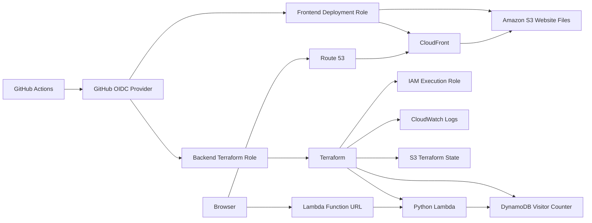

# Cloud Resume Challenge — Felix Laura

A cloud-hosted resume and visitor counter built with AWS, Terraform, Python, GitHub Actions, and GitHub OIDC.

**Live site:** https://www.felix-laura.com  
**Repository:** https://github.com/felixala/cloud-resume-felix

## Overview

This project hosts a static resume website in Amazon S3 behind Amazon CloudFront. A JavaScript visitor counter calls a public AWS Lambda Function URL. The Lambda function atomically increments a counter in Amazon DynamoDB and returns the updated value.

Infrastructure is managed with Terraform. GitHub Actions deploys the frontend and backend by assuming separate AWS IAM roles through OpenID Connect (OIDC), so the repository does not require long-lived AWS access keys.

## Architecture



## AWS services

- Amazon S3 for static website files
- Amazon CloudFront for HTTPS delivery and caching
- Amazon Route 53 for DNS
- AWS Certificate Manager for TLS
- AWS Lambda for the visitor-counter API
- Lambda Function URL for the public HTTP endpoint
- Amazon DynamoDB for the visitor count
- Amazon CloudWatch Logs for Lambda logging
- AWS IAM and GitHub OIDC for short-lived deployment credentials
- Terraform for infrastructure as code

## Repository structure

```text
cloud-resume-felix/
├── .github/
│   └── workflows/
│       ├── backend_deploy.yml
│       └── frontend_deploy.yml
├── IaC/
│   ├── lambda/
│   │   ├── lambda_function.py
│   │   ├── lambda_function_test.py
│   │   └── requirements_dev.txt
│   ├── main.tf
│   ├── outputs.tf
│   ├── provider.tf
│   └── variables.tf
├── website/
│   ├── index.html
│   └── assets/
├── .dockerignore
├── .gitignore
├── Dockerfile
└── README.md
```

## Backend

The Lambda function:

1. Accepts `GET` requests.
2. Uses DynamoDB `UpdateItem` to increment the counter atomically.
3. Returns JSON such as:

```json
{
  "views": 42
}
```

Unsupported methods return HTTP `405`. Unexpected database errors return a safe HTTP `500` response without exposing internal exception details.

## Infrastructure as code

Terraform creates and manages:

- DynamoDB table `CloudResumeViewCount`
- Lambda function `CloudResumeViewCountFunction`
- Lambda execution role `iam_for_lambda`
- Least-privilege Lambda permissions policy
- Lambda Function URL and CORS configuration
- CloudWatch log group and retention
- Resource tags

Terraform state is stored in a separate private, encrypted, versioned S3 bucket with S3 lock-file support.

## CI/CD and OIDC

### Backend workflow

`.github/workflows/backend_deploy.yml`:

- Runs Python unit tests with `pytest` and Moto
- Checks Terraform formatting
- Runs `terraform validate`
- Assumes `CloudResumeBackendTerraformRole` with GitHub OIDC
- Initializes the remote Terraform state
- Creates and applies a saved Terraform plan
- Displays the generated Lambda Function URL in the workflow summary

### Frontend workflow

`.github/workflows/frontend_deploy.yml`:

- Validates the `website/` directory
- Replaces `__LAMBDA_FUNCTION_URL__` in `website/index.html`
- Assumes `CloudResumeFrontendDeployRole` with GitHub OIDC
- Synchronizes `website/` to the S3 website bucket
- Deletes obsolete S3 objects
- Invalidates the CloudFront cache

The workflows deploy from the `master` branch.

## Required GitHub Actions variables

Configure these under:

`Repository Settings → Secrets and variables → Actions → Variables`

### Shared

```text
AWS_ACCOUNT_ID
```

### Backend

```text
AWS_BACKEND_ROLE_ARN
TF_STATE_BUCKET
```

### Frontend

```text
AWS_FRONTEND_ROLE_ARN
AWS_S3_BUCKET
CLOUDFRONT_DISTRIBUTION_ID
LAMBDA_FUNCTION_URL
```

`LAMBDA_FUNCTION_URL` is a public endpoint and can be stored as a repository variable. Long-lived `AWS_ACCESS_KEY_ID` and `AWS_SECRET_ACCESS_KEY` secrets are not required.

## Run the Lambda tests locally

```bash
cd IaC/lambda

python -m venv .venv
source .venv/bin/activate

python -m pip install --upgrade pip
pip install -r requirements_dev.txt
pytest -v
```

On Windows PowerShell, activate the environment with:

```powershell
.venv\Scripts\Activate.ps1
```

## Preview the website with Docker

The Docker image is intended for local frontend preview. Production continues to use S3 and CloudFront.

Build the image with the deployed Lambda Function URL:

```bash
docker build \
  --build-arg LAMBDA_FUNCTION_URL="https://YOUR_FUNCTION_ID.lambda-url.us-east-1.on.aws/" \
  -t cloud-resume-frontend .
```

Run it:

```bash
docker run --rm -p 8080:80 cloud-resume-frontend
```

Open:

```text
http://localhost:8080
```

### Local counter and CORS

The current Terraform configuration allows the production origins:

```text
https://felix-laura.com
https://www.felix-laura.com
```

To test the counter from Docker, temporarily add this origin to `allowed_origins` and apply Terraform:

```text
http://localhost:8080
```

Remove the localhost origin again when it is no longer needed.

## Deploy

### Backend first

Push changes affecting `IaC/**` or the backend workflow:

```bash
git add IaC .github/workflows/backend_deploy.yml
git commit -m "Update cloud resume backend"
git push origin master
```

After the backend workflow succeeds, copy the generated Function URL into the GitHub variable `LAMBDA_FUNCTION_URL`.

### Frontend second

```bash
git add website .github/workflows/frontend_deploy.yml
git commit -m "Update cloud resume frontend"
git push origin master
```

The frontend workflow injects the Function URL, uploads the website, and invalidates CloudFront.

## Security design

- GitHub Actions uses short-lived OIDC credentials.
- Frontend and backend deployments use separate IAM roles.
- The frontend role is limited to the website S3 bucket and CloudFront invalidation.
- The backend role is limited to the Terraform-managed backend resources and state path.
- The Lambda execution role can update only the visitor-counter table and write to its log group.
- The Terraform state bucket is private and separate from the website bucket.
- CORS is restricted to approved origins.
- Application errors do not expose internal database details.

## Troubleshooting

### Counter displays `error`

1. Open the Lambda Function URL directly and confirm it returns JSON.
2. Confirm `LAMBDA_FUNCTION_URL` contains the current Terraform-created URL.
3. Rerun the frontend workflow after changing the variable.
4. Check the browser console for CORS errors.
5. Verify the current domain is included in Terraform `allowed_origins`.
6. Check CloudWatch Logs for Lambda errors.

### OIDC role cannot be assumed

Confirm the AWS role trust policy matches:

```text
repo:felixala/cloud-resume-felix:ref:refs/heads/master
```

Also confirm the workflow job includes:

```yaml
permissions:
  contents: read
  id-token: write
```

### Terraform cannot access state

Confirm:

- `TF_STATE_BUCKET` contains only the bucket name
- The value has no leading or trailing spaces
- The state bucket already exists
- The backend OIDC role can access the state and `.tflock` objects

## Author

**Felix Laura**

- Portfolio: https://www.felix-laura.com
- GitHub: https://github.com/felixala
- LinkedIn: https://www.linkedin.com/in/felixala/
